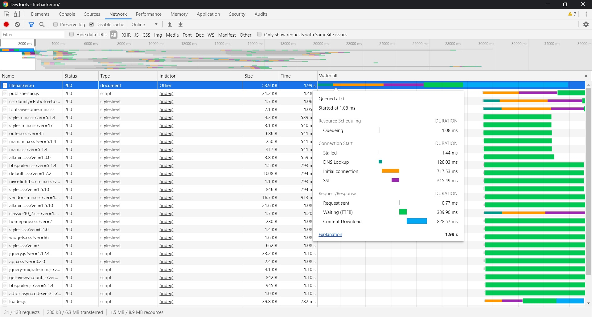
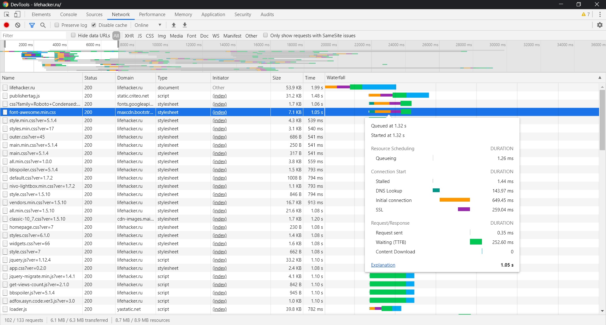
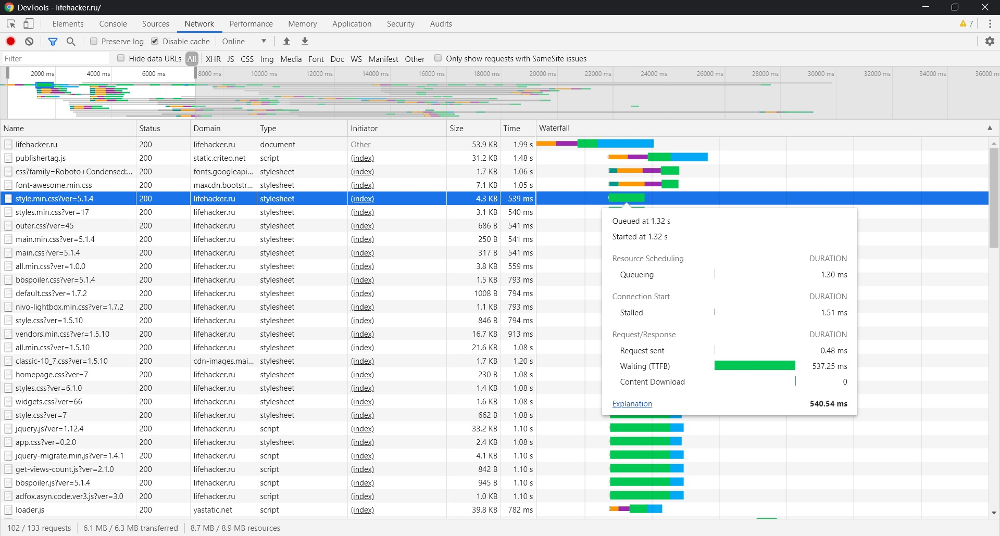
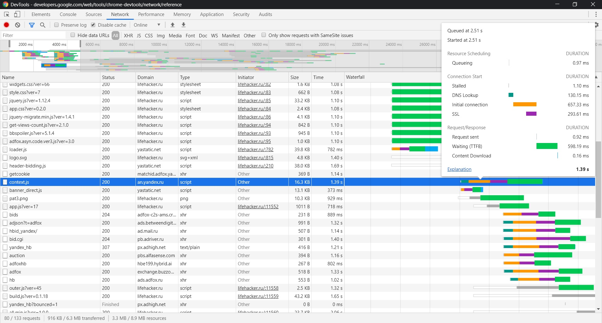
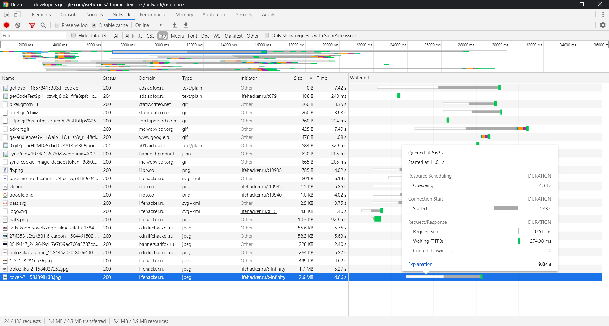

# tooling

## network
0ms - первое что бросается в глаза, это медленная загрузка html, что в свою очередь откладывает загрузку js.

1320ms - загрузка шрифтов с cdn. Есть еще несколько мест с загрузкой шрифтов и картинок.

1320ms - сразу же видно, что css загружается большим количеством маленьких файлов, что генерирует большое кол-во запросов.
Нужна минификация css и сборка в один файл. Но похоже, что главная проблема этого сайта - это WordPress.

2510ms - загрузка скриптов/ресурсов контестной рекламы, что блокирует последующие запросы.

2730ms - загрузка app.js?ver=0.2.0. Загрузка js мальнькими файлами. Нужна минификация и объединение в один файл. Возможно загружаются разные версии одного и того же файла (ver=0.2.0). В css тоже есть такие моменты 

6630ms - загрузка картинки размером 2.6 Мб. Скорее всего можно сжать. Также есть еще такие примеры.

##perfomance

First paint - 9466.7 ms
First Meaningful Paint - 9783.4 ms
DOMContentLoaded Event - 13143.2 ms
Loaded -32111.8 ms

Loading - 120 ms
Scripting - 3591 ms
Rendering - 3345 ms
Painting - 431 ms

##coverage

387 Kb - объем неиспользованного css
1400 Kb - объем неиспользованного js